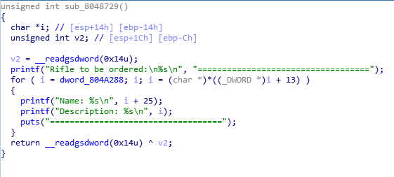

# fastbin原理：<br>
1.堆溢出修改堆块结构中指向下一个堆块的指针,指向伪造的chunk<br>
2.伪造chunk,为了绕过next_size,要保证伪造的chunk的下一个chunk的大小不能太大或者太小<br>
3.然后free这个伪造的chunk,然后malloc一个相同大小的chunk,达成对伪造chunk的读写<br>


## 这里使用hack.lu-oreo记录fastbin的学习小结

add-增加堆块（漏洞点：在dword_804A288+25(name)的地方读取了56个字节，但是总共只申请了0x38=56个字节，所以可以溢出）<br>
gan的结构体为<br>
```
struct{  
    char* description;
    char* name;
    gan* last_heap;
}gan
```
所以这里可以溢出到last_heap<br>

<br><br>
show-展示堆块(漏洞点：打印堆块的是，由于可以溢出到last_heap，那么可以将last_heap修改成任意的got表地址，那么在打印堆块的时候，就会将got表地址里面的值当成description打印出来)<br>

<br><br>

order-delete堆块(漏洞点:日常不置空)<br>
<br><br>

leaveMessage(漏洞点：这个函数会往bss段写数据，但是他是往dword_804a2a8这个地址里面的值作为地址写数据，如果这个地址可以控制，那么就可以往任意地址写数据了)<br>
<br><br>

## 利用思路
1.


